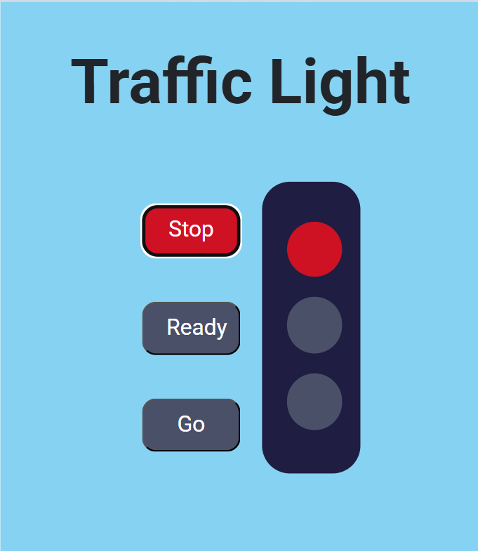

# 🚦 Traffic Light Mini Project

This is a beginner-friendly mini project that simulates a traffic light system using **HTML**, **CSS**, and **JavaScript**. The project changes the lights and corresponding button colors based on user interaction — providing a clear understanding of DOM manipulation and event handling.

---

## 🔧 Tech Stack

- HTML5
- CSS3
- JavaScript (Vanilla JS)

---

## 🎯 Functionality

- 🟥 Clicking the **Stop** button turns the light and button red.
- 🟨 Clicking the **Ready** button turns the light and button yellow.
- 🟩 Clicking the **Go** button turns the light and button green.
- Resets other lights and buttons to default background.

---

## 🧠 What I Learned

- DOM element selection using `getElementById`
- Event listeners for button click events
- Dynamic styling using `style.backgroundColor`
- Real-world simulation using code logic
- Importance of UI consistency and user feedback

---

## 📸 Preview

---

## 🚀 Live Demo

👉 [Click here to view live](https://your-live-link.netlify.app/)  
👉 [GitHub Repository](https://github.com/praveenkumarkota-dev/traffic-light)

---

## 📚 Keywords & Tags

`HTML` `CSS` `JavaScript` `DOM Manipulation` `Frontend Project` `Mini Project` `Traffic Light Simulation` `NxtWave Projects` `Web Development Practice`

---

## 📬 Connect With Me

📍 [LinkedIn](https://www.linkedin.com/in/praveen-kumar-kota)  
📦 [GitHub](https://github.com/praveenkumarkota-dev)
